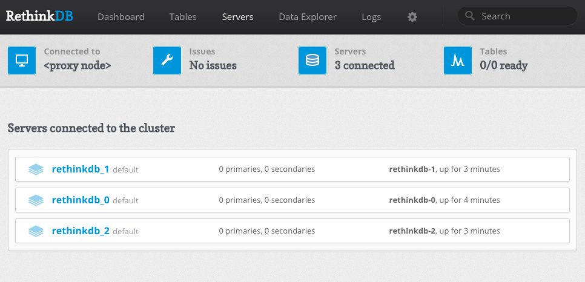

This fork...
============
This is fork of rosskukulinski's great work. This fork removed any non stateful set options, made the admin pod launch with the service account defined in the rbac yaml as it need it to hit the kubernetes API. The admin service is not a load balancer now and is just a cluster ip service. Its exposed via an ingress. The ingress is using cert manager to provide tls and does some basic auth.

Cert manager/issuer/custom ingress class/etc stuff is not part of this repo. Ingress file will need a few changes (like using your own domain).

I have a fork of the original docker image as well. It does absolutely nothing except bump up the rethinkdb version to 2.4. 

https://github.com/worldspawn/rethinkdb-kubernetes

Build it and push to docker hub or your own repository.

All the pulls reference a docker image secret, remove that for docker hub.

Rethinkdb StatefulSet
=====================

This directory contains a [StatefulSet](https://kubernetes.io/docs/concepts/abstractions/controllers/statefulsets/). 
Note: StatefulSets are a beta feature in 1.5

GKE Instructions
================
// TODO

AWS Instructions
================
It appears that the PersistentVolumeClaims create the EBS automatically.

```bash
# Start the service. 
╰─$ kubectl create -f rethinkdb-service.yml 
service "rethinkdb" created

# Create the StatefulSet
╰─$ kubectl create -f rethinkdb-statefulset.yml 
statefulset "rethinkdb" created

# Start up an admin server and service.
╰─$ kubectl create -f rethinkdb-admin.yml 
service "rethinkdb-admin" created
deployment "rethinkdb-admin" created

# Poke around to verify...
╰─$ kubectl get pv
NAME                                       CAPACITY   ACCESSMODES   RECLAIMPOLICY   STATUS    CLAIM                      REASON    AGE
pvc-a3a8ebf7-df4e-11e6-ac2e-02b95063087e   10Gi       RWO           Delete          Bound     default/data-rethinkdb-0             5m
pvc-a3b11fc6-df4e-11e6-ac2e-02b95063087e   10Gi       RWO           Delete          Bound     default/data-rethinkdb-1             5m
pvc-a3b6feea-df4e-11e6-ac2e-02b95063087e   10Gi       RWO           Delete          Bound     default/data-rethinkdb-2             5m
╭
╰─$ kubectl get statefulset,po,svc
NAME                     DESIRED   CURRENT   AGE
statefulsets/rethinkdb   3         3         5m

NAME                                  READY     STATUS    RESTARTS   AGE
po/rethinkdb-0                        1/1       Running   0          5m
po/rethinkdb-1                        1/1       Running   0          4m
po/rethinkdb-2                        1/1       Running   0          4m
po/rethinkdb-admin-1722877930-wr6km   1/1       Running   3          5m

NAME                  CLUSTER-IP    EXTERNAL-IP        PORT(S)          AGE
svc/rethinkdb         None          <none>             29015/TCP        5m
svc/rethinkdb-admin   10.0.147.93   aa386db9cdf4e...   8080:30993/TCP   5m
╭
```

Warning! 
The admin service is type LoadBalancer so it will create an ELB for you. The admin service is NOT secured.

Find the ELB in the AWS console and visit port :8080. You should see three servers in the servers tab.


